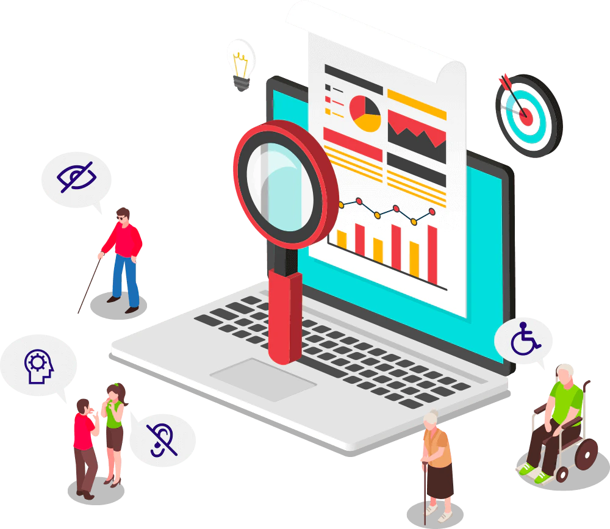
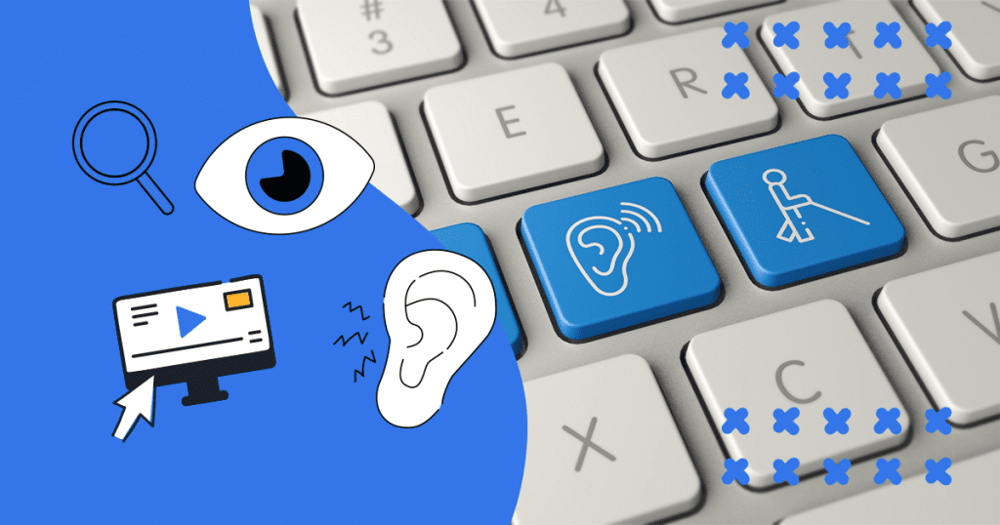
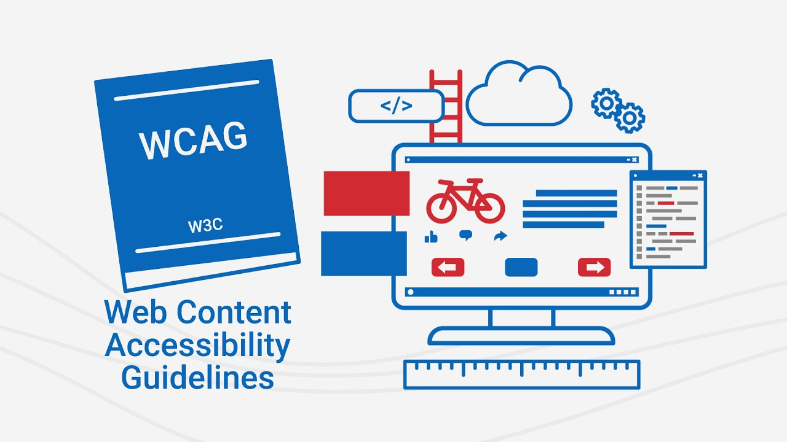
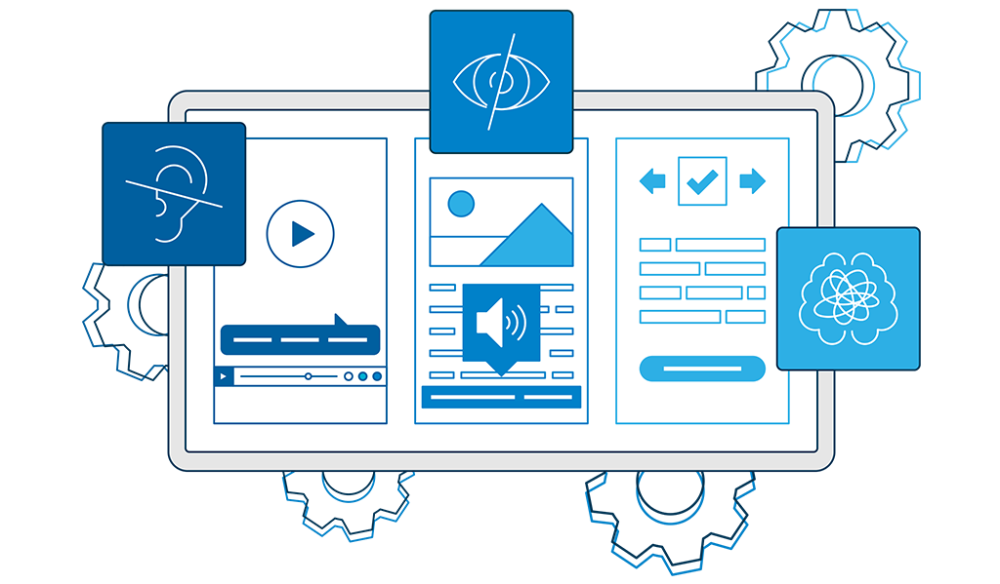
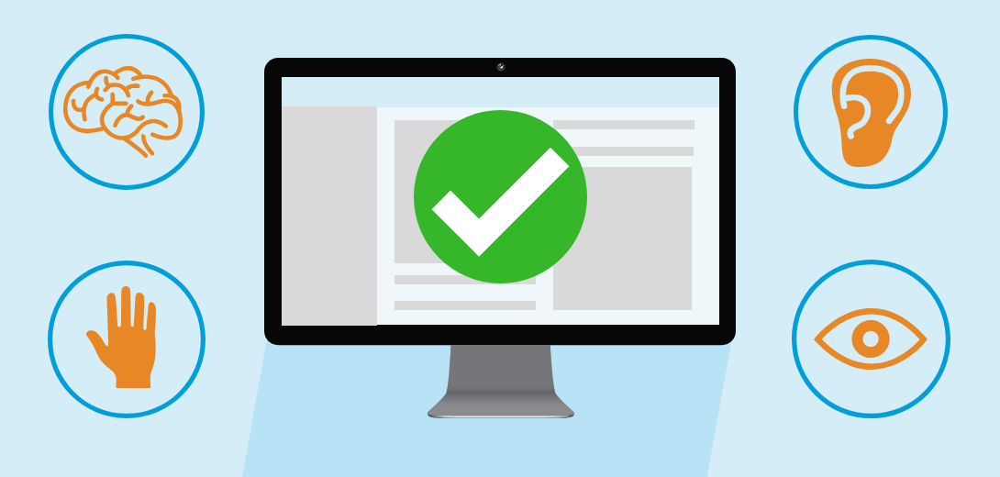
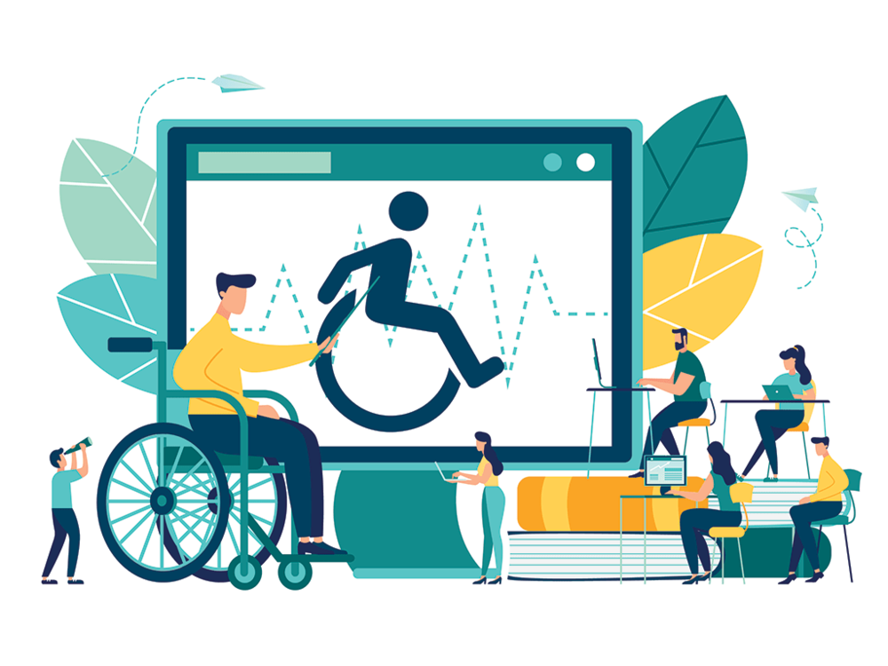
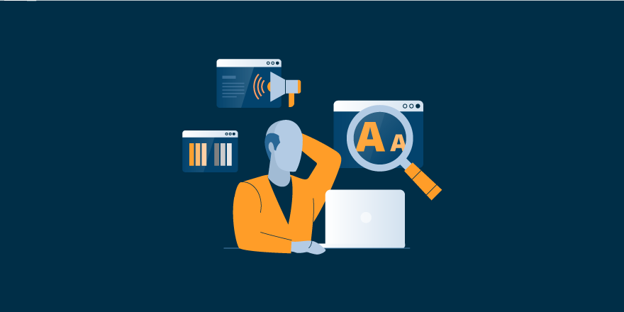
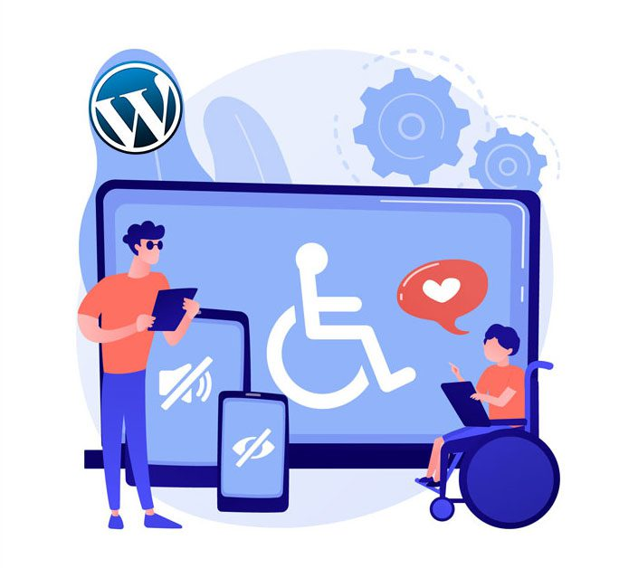

# 1. Digital Accessibility 
 
 
Digital Accessibility is all about making sure that all users can get full access to digital content regardless of their impairments. The current era is called the era of digital media. More and more people are relying on digital services for work, entertainment etc. Literally everything we do in our life is somehow related to digital services these days. Today, a lot of digital interfaces are created with a focus heavily on the visual impact they are having but digital accessibility is mostly overlooked. This ignorance leads to a huge portion of the people getting deprived of accessing digital contents. It means people with disabilities can't do even basic things such as attending online classes, socializing with friends online, using government services and so on. It is totally unexpected as so many people rely on digital services these days for even basic day to day activities. Thus, digital accessibility is crucial for creating an inclusive world for everyone. 
   

## What is Digital Accessibility? 
 
 
Accessibility is ensuring that devices, products and environments are convenient for all users despite any impairments they might have. The concept of digital accessibility is pretty much similar. Digital accessibility allows everyone to have full access to digital content despite their impairments. It refers to how usable a website, app or digital service is to all sort of users including disabled people. For example, a website must be navigable using keyboard for users who might not be able to operate a mouse. If a website has only one way of navigation, then it might be inaccessible for a significant portion of people. Thus, it is important to ensure multiple ways of navigation. 
   

## Principles of Digital Accessibility 
 
 
There are four principles of web accessibility by the WCAG (Web Content Accessibility Guidelines). These are: 

1. Perceivable: Users must be able to perceive the information being presented.  

2. Operable: Users must be able to interact with the interface. 

3. Understandable: Users must be able to understand the information and the operation of the interface. 

4. Robust: The content should be accessible by wide variety of technologies. 

The lack of any one of these principles will make the web less accessible. 
   

## Examples of Digital Accessibility 
 
 
Some common digital accessibility features are: 
 
 

-> All functionalities should be accessible by keyboard. 

-> Screen reading functionalities should be provided. 

-> Alt texts should be provided for all images. 

-> Subtitles should be provided for videos. 

-> Hyperlinks should be properly formatted. 

-> Each page on a website should give a consistent user experience. 
   

## Why Ensure Digital Accessibility? 
 
 

The question shouldn’t be why ensure digital accessibility. The question should be why not ensure digital accessibility starting from right now? Nearly 20% of the people living with a disability. Not everyone can easily access all the digital services. As our world has digitalized dramatically in the last few decades, it has become more important than ever before to focus on digital accessibility right now. Ensuring digital accessibility means ensuring equal access to online education, health care, e-commerce, employment and so on. It is our moral obligation to ensure digital accessibility. 

Now let’s talk about business perspectives. Digital accessibility is a huge boost for business. For example, YouTube has subtitles for videos which makes it more accessible for people. It leads to more users, which translates into profit. People are more likely to spend more money in services which are easily accessible. Ensuring digital accessibility is also a very good SEO practice too.  

Ensuring digital accessibility proves that a company is professional and cares about user experience which helps a company’s business to boom. 
   
 
 

## Conclusion 
 
 
The most important thing to realize is digital accessibility is not an optional thing anymore. As the world has digitalized dramatically, the need for ensuring digital accessibility has skyrocketed. It has become a fundamental right for all kinds of people to get equal opportunity to access digital services. There are several worldwide regulations, guidelines and standards that protect the rights of disabled people. Thus, ensuring digital accessibility is not just a moral obligation but also a responsibility too.  

       
# 2. Current Challenges of Digital Accessibility & Possible Solutions 
 
 
The capabilities of digital devices and services are increasing rapidly day by day. But sadly, it is not the same when it comes to digital accessibility. There are many challenges of ensuring digital accessibility. In this article, we will be discussing few of these challenges and possible solutions to overcome these challenges.     

## Challenges of Digital Accessibility 
 
 

### Lack of awareness 

The major issue of ensuring digital accessibility is lack of awareness. Most digital service providers and developers are not concerned about digital accessibility. Most of them don’t even know the term ‘Digital Accessibility’ which is the most alarming fact.   

### Lack of willpower & motivation  

Accessibility is often seen as a niche requirement. Many developers know the guidelines of digital accessibility but still lack the motivation and willpower to go one extra mile to ensure digital accessibility. 

### Compliance Culture  

Many developers are only concerned about fulfilling minimum requirements to get their service online. They are just happy to comply with the minimum requirements instead of truly implementing and testing digital accessibility features. 

### Lack of skills and resources  

Lack of skills and resources are also major barriers. Most developers are not skilled enough to implement accessibility features. Resource limitation is a major factor too. 

### Lack of governance  

Though there are guidelines like ‘Web Content Accessibility Guidelines’ (WCAG), there is clearly a lack of governance when it comes to ensuring digital accessibility. Most of the digital services lack accessibility features and still they are not held accountable for this. 
   

## Possible Solutions 
 
 

### Raising awareness 

The best and primary way to solve any problem is raising awareness and educating people about the cause. Same goes for digital accessibility. We must educate people about the importance of ensuring digital accessibility. Society can’t function properly by depriving a huge percentage of disabled people from accessing digital services. Thus, we must promote inclusiveness. 

### Focusing on UX design 

More focus must be given to UX design. User experience should be the priority before implementing any digital service. An inclusive design strategy must be adopted. 

### Skill Development 

As mentioned earlier, lack of skill is also a major barrier. So, necessary training should be given to developers so that they become capable enough to implement digital accessibility features. 

### Improving Governance 

More regulations and guidelines should be provided for ensuring digital accessibility. These rules and regulations must be strictly imposed and monitored. 

### Progressing from Compliance to Real Accessibility	 

Only abiding by the regulations is not good enough. Digital accessibility features must be tested on a pool of disabled people to get real life feedbacks. Only then can real accessibility be ensured. 
  
 
 
 
 

Achieving inclusion worldwide is a big and complex challenge. Same goes for Digital Inclusion too. But proper guidelines, awareness and skill development surely help to overcome all the obstacles of ensuring digital accessibility.   

        
 
 # 5. Unboxing Windows 11 - Part 1
  
 
In October 2021, Microsoft launched Windows 11, the most recent major release of its Windows NT operating system. It's a free upgrade from Windows 10 (2015), and it's accessible for any Windows 10 device that meets the new Windows 11 system requirements. Windows 11 was redesigned for productivity, creativity and ease of use.

Windows 11 includes a redesigned Start menu, the replacement of its "live tiles" with a separate "Widgets" panel on the taskbar, the ability to create tiled sets of windows that can be minimised and restored from the taskbar as a group, and new gaming technologies inherited from Xbox Series X and Series S such as Auto HDR and DirectStorage on compatible hardware. Like its predecessor, Windows 10, Internet Explorer (IE) has been replaced as the default web browser by the Chromium-based Microsoft Edge, and Microsoft Teams has been incorporated into the Windows shell. Microsoft also announced plans to allow more flexibility in software that can be distributed via Microsoft Store, and to support Android apps on Windows 11.
   

## Windows team's ambition: Beyond possible, efficient, and yes, delightful 
 

In the Windows team, they aspire to create efficient, fun and delightful experiences for people with disabilities and without. They root their ambition in the [principles of inclusive design](https://www.microsoft.com/design/inclusive/), which celebrates and draws inspiration from people with different abilities, needs and preferences.
   

## Windows 11 is the most inclusively designed version of Windows yet
 

Windows 11 was created with persons with disabilities in mind, supporting productivity, creativity, and simplicity of use. Windows adapts to you with a rich range of built-in and third-party accessibility capabilities. Assistive technologies such as Narrator, Magnifier, Closed Captions, and Windows Speech Recognition are included in Windows 11 to help users with a variety of disabilities. Assistive solutions created by partners, such as popular screen readers, magnification tools, CART services, speech commands, and other experiences, are also supported in Windows 11. Beyond designing for accessibility Microsoft employed [Trusted Tester](https://www.dhs.gov/trusted-tester) conformance tests, usability tests and other processes to help ensure Windows 11 is accessible at availability. 

With Windows 10, assistive technologies were made to work with secure applications like Word in Windows Defender Application Guard(WDAG). With Windows 11, it is now possible for both Microsoft and partner assistive technologies to work with applications like Outlook hosted in cloud, in [Azure Virtual Desktop (AVD)](https://azure.microsoft.com/en-us/free/virtual-desktop/?OCID=AID2100131_SEM_e06386f96dd015e27a2ae62f155af315:G:s&ef_id=e06386f96dd015e27a2ae62f155af315:G:s&msclkid=e06386f96dd015e27a2ae62f155af315). Using Narrator, for example, Office may be accessed as a Remote Application Integrated Locally (RAIL) with Windows 11. While this may appear to most people to be a lot of jargon, it has a big impact. When they require it, blind people will be able to use Azure-hosted applications such as Office.

On devices that meet the app system requirements, Windows 11 will also enable Linux GUI apps like gedit via the Windows Subsystem for Linux (WSL). People who are blind, for example, can use WSL and Windows with supported screen readers. In certain circumstances, the integration of assistive technology is smooth. Color Filters, for example, "just work." Importantly, the WSL team prioritised accessibility from the start.
   

## Windows 11 for all
 

Not only is it free to get, it includes many improvements.

_Do you have sight problems?_ Fret not! New sound schemes are included to make work easier. Windows 11 contains various sounds for more accessible Light and Dark Themes including a delightful start-up. People (like me!) who work for extended periods of time and light sensitive have the option to switch between various beautiful color themes, including new Dark themes and reimagined High Contrast Themes. The new Contrast Themes include aesthetically pleasing, customizable color combinations that make apps and content easier to see. It seems Aurora has shifted its location to my system!  
_Deaf and hard of hearing_, language learners, and people in noisy or in quiet environments can enjoy redesigned Closed Caption themes that are easier to read and customize.  
Additionally, a variety of users can take advantage of Windows Voice Typing, which recognizes voice, transcribes it, and automatically punctuates text using cutting-edge artificial intelligence. Voice typing is beneficial for those who have severe _rheumatoid arthritis, repetitive stress injuries, cerebral palsy, and other mobility-related problems_, as well as language learners, those with learning differences, including those who have significant spelling difficulties.  

_**"People with disabilities do not need to be fixed: they need to be accepted for who they are."**_
  
says _Jordan Christian_, Apraxia & Mental Health Advocate. Microsoft have accepted everyone for who they are and ultimately, the simplified design and user experience of Windows 11 allows everyone to enjoy. It is modern, fresh, clean and beautiful.
   

## So many features, where can I find them all?
 

_Hide all these awesome features under a bushel? NO NO NO!!!_ Microsoft has considered feedback from all of its users about its previous "**Ease of Access**" settings that its purpose and icon was unclear. So, they have rebranded Ease of Access Settings to **Accessibility** and introduced a new accessibility “**human**” icon. This redesign was to make them easier to use. And the best part is that, Accessibility features are available in the out of box experience and on the Log on and Lock screens so that users can independently setup and use their devices, e.g., with Narrator.
       

 
 # 6. Unboxing Windows 11 - Part 2
  
 
 In this blog we will experiment with all the Accessibility features available in Windows 11. Microsoft has categorized these features into four categories - _Vision, Hearing, Mobility, Neurodiversity and Learning_. Let's start exploring! Here we go!
   

## 1. Vision
 

With Windows 11, it's simple to customize your viewing experience or ignore the screen altogether thanks to the display and screen-reading features.
 

### See every detail—without the strain
 
You may use the new Dark themes and Contrast themes in Windows 11 to lower screen brightness and boost contrast without sacrificing aesthetics, whether you are sensitive to light or you simply spend a lot of time in front of a screen.
 
Here are some simple steps to get started with:
  

1. Select the **Start** button, and then select **Settings** > **Accessibility** > **Contrast themes**. 
2. To turn on contrast themes, select the theme you want from the **Contrast themes** drop-down menu, and then select the **Apply** button. Windows may display a “Please wait” screen for a few seconds, after which the colors on the screen change.  
3. To turn off contrast themes, select the None option from the Contrast themes drop-down menu, and then select the Apply button. Windows may again display a “Please wait” screen for a few seconds, after which the colors on the screen change back to default.  

_Tip: Press the left Alt key + left Shift key + Print screen (Print Scrn on some keyboards) to quickly turn high contrast mode on or off._
	
   
	
You can also create your own customized theme by following these steps:
  
1. After selecting a theme, select the **Edit** button under the **Contrast themes** drop-down menu. You can modify the color of the following screen elements:  
	• **Text:** nearly all text you see in Windows or on a web page, for example. 
	• **Hyperlinks:** all hyperlinks you see in Windows or on a web page, for example. 
	• **Disabled Text:** text that would normally be grayed out, for example, when you cannot select a specific option or button. 
	• **Selected Text:** any selected menu item or option. For example, the alignment of the currently selected paragraph in Word is indicated with this color on the tool ribbon. 
	• **Button Text:** text on any buttons that contain text. 
	• **Background:** the background of nearly all text you see in Windows or on a web page, for example. 
2. Select a new color by clicking on the color picker palette, adjust the selected color’s brightness using the slider under the palette, and select **Done**. 
3. To save any color changes you have made to the theme, select **Apply**.  

	**Source:** [Change color contrast in Windows](https://support.microsoft.com/en-us/windows/change-color-contrast-in-windows-fedc744c-90ac-69df-aed5-c8a90125e696#PickTab=Windows_11)
	 

### Zoom in on what’s important
 
The display and vision settings make it simple to tailor your viewing experience, allowing you to change the font size, mouse cursor color and size, and more. Do you need to focus a little more? Like a digital magnifying glass, Magnifier can be used to enlarge words and images on a portion or the entire screen.
 
Here are some simple options that we can use:
  

• To **_adjust the size_** of text, apps, and other items, select the **Start** button, then select **Settings** > **Accessibility** > **Text size**. Use the slider next to Text size to make just the text on your screen larger. To scale up everything on your screen, select the Start button, then select **Settings** > **System** > **Display**, and change the **Scale** drop-down menu under **Scale & Layout** to a larger percentage.  

• Make your mouse more visible by changing the color and size of the **_mouse pointer_**. Select the **Start** button, then select **Settings** > **Accessibility** > **Mouse pointer & touch**, and choose the options that work best for you. By adding pointer trails you can see where the mouse is moving on the screen. Select the **Start** button, then select **Settings** > **Bluetooth & devices** > **Mouse** > **Additional mouse settings**. In the **Mouse Properties** window, select the **Pointer Options** tab, and then **Display pointer trails**. Windows can also show visual feedback when you touch the screen. Select the **Start** button, then select **Settings** > **Accessibility** > **Mouse pointer & touch**, and then set **Touch indicator** to **On**.  

• **_Magnifier_** enlarges part or all of your screen so you can see words and images better. To open Magnifier quickly, press the **Windows logo key + Plus sign (+)**. When Magnifier is open, use **Windows logo key + Plus sign (+)** or **Windows logo key + Minus sign (-)** to zoom in or out. To close Magnifier, press **Windows logo key + Esc**.  
 
**Soure:** [Make Windows easier to see](https://support.microsoft.com/en-us/windows/make-windows-easier-to-see-c97c2b0d-cadb-93f0-5fd1-59ccfe19345d#PickTab=Windows_11)
 
 
### Distinguish colors easily
 
With the aid of color filters, you can alter the color palette on your computer to better suit your visual preferences or color blindness.
 

To use a color filter:
  

1. To go to the **Accessibility** settings on your computer, press the Windows logo key+U or select **Start**  > **Settings**  > **Accessibility**. 
2. Select **Color filters**. 
3. Turn the **Color filters**  switch on. 
4. Select a color filter from the list. Try each filter to see which one suits you best.  

To turn on and turn off your color filters quickly, select the **Start** button, then select **Settings** > **Accessibility** > **Color filters**, and set **Keyboard shortcut for color filters** to **On**. Then press the **Windows logo key + Ctrl + C** to turn them on and off.
  

**Source:** [Use color filters in Windows](https://support.microsoft.com/en-us/windows/use-color-filters-in-windows-43893e44-b8b3-2e27-1a29-b0c15ef0e5ce#PickTab=Windows_11&WindowsVersion=Windows_11)
 
 
### Make your PC speak for itself
 

You can simply interact with everything on your screen with your keyboard or preferred Braille device thanks to Narrator's streamlined navigation and voice descriptions. With no need for a screen, lay back and catch up on the news or start working on your email.
  
To start or stop Narrator, press the **Windows logo key + Ctrl + Enter**.
  
For advanced options refer [Complete guide to Narrator](https://support.microsoft.com/en-us/windows/complete-guide-to-narrator-e4397a0d-ef4f-b386-d8ae-c172f109bdb1#WindowsVersion=Windows_11&ID0EBD=Windows_11)
   

## 2. Hearing
 
If you have trouble hearing your computer, Windows 11 provides settings and tools that can help, such as captioning and audio choices.
 

### Read and enjoy
 

You can use captions to read the spoken words in the videos you view, regardless of whether you're deaf, hard of hearing, learning a new language, or simply watching in a noisy area. Additionally, you may more easily personalise your experience with Windows 11's revamped caption themes by adjusting the text size, font, colour, and background.
 
To define how the captions appear in Windows and some Windows apps, you can select one of the predefined caption options or customize an option to better suit your needs.
  
1. Select **Start** > **Settings** > **Accessibility** > **Captions**.
2. In **Caption style**, expand the menu, select one of the predefined options, and see how it appears in the preview.
3. To customize the selected predefined option, select **Edit** and then modify the option details to your liking.
  

**Source:** [Change caption settings](https://support.microsoft.com/en-us/windows/change-caption-settings-135c465b-8cfd-3bac-9baf-4af74bc0069a)
 
	
### Don’t miss a beat
 

Windows 11 can help you hear more from your computer if you have a partial hearing loss or are deaf in one ear. You can hear every detail thanks to mono audio, which mixes the left and right stereo audio channels frequently used in contemporary music creation.
 

#### Hear all sounds in one channel
 

Windows lets you convert stereo sound into a single channel so you can hear everything, even if you're using just one headphone. Select the **Start**  button, then select **Settings**  > **Accessibility** >** Audio**, and then switch on the **Mono audio** toggle.
  

#### Display audio alerts visually
 

If you have trouble hearing audio alerts, you can have your PC display them visually. Select the **Start** button, then select **Settings**  > **Accessibility** > **Audio**.
 
Under Flash my screen during audio notifications, choose how you want audio alerts displayed. You can choose to have the title bar of the active window, the active window, or the entire screen flash when a notification arrives, instead of relying on sound alone.
  

#### Make notifications stick around longer
 

By default, Windows notifications disappear five seconds after they appear. If you want more time to read them, you can increase how long they're displayed.
 

Select the **Start** button, then select **Settings**  > **Accessibility** > **Visual effects**. Then, under **Dismiss notifications after this amount of time**, choose the amount of time you want.
  	
	
**Source:** [Make Windows easier to hear](https://support.microsoft.com/en-us/windows/make-windows-easier-to-hear-9c18cfdc-63be-2d47-0f4f-5b00facfd2e1)
   

## 3. Mobility
 

If you have physical limitations that make it difficult for you to use a keyboard or mouse, Windows 11 can help you use a pen, your voice, or even your eyes to connect with your computer.
 
	
### Control Windows and apps with your eyes
 

With a range of eye tracking-enabled cameras and an intuitive launch pad that gives your eyes the power to control anything on the screen, Eye Operate makes it simple and effective to control Windows and apps (eye tracking hardware sold separately).  

To set up your **eye tracking hardware** refer [Get started with eye control in Windows](https://support.microsoft.com/en-us/windows/get-started-with-eye-control-in-windows-1a170a20-1083-2452-8f42-17a7d4fe89a9#ID0EBD=Windows_11)
 
	
### Type and navigate with your voice
 

Windows voice typing will translate your words to text whether you're writing a document, an email, or browsing the web. Thanks to AI, it will even take care of the punctuation! 
	To turn on voice typing:
   
	• Press **Windows logo key + H** on a hardware keyboard 
	• Press the **microphone key** next to the Spacebar on the touch keyboard 
	• Say a voice typing command like "Stop listening" 
	• Press the microphone button on the voice typing menu  
 
For more advanced options check [Use voice typing to talk instead of type on your PC](https://support.microsoft.com/en-us/windows/use-voice-typing-to-talk-instead-of-type-on-your-pc-fec94565-c4bd-329d-e59a-af033fa5689f#PickTab=Windows_11&WindowsVersion=Windows_11)
	   
 
## 4. Neurodiversity and learning
 
With tools that improve focus, attention, reading comprehension, and more, Windows 11 enables you to reach your full potential.
 

### Improve reading comprehension
 
By eliminating visual clutter, changing text spacing, or zooming in on a few lines of text at a time, Immersive Reader in Microsoft Edge can help you read more fluently, comprehend what you are reading, and stay focused. 
Entering Reader Mode in Immersive Reader will simplify the page you're on by hiding distracting pop-ups and buttons, leaving you with just the important parts: textual and visual content. Once you enter Reader Mode, start using tools like **Read Aloud**, **Text preferences**, **Grammar tools** and **Reading preferences**.  
 
To enter Reader Mode, use Microsoft Edge to visit a website you want to read. Select **Enter Immersive Reader** in the address bar or use the keyboard shortcut F9. 
To exit Immersive reader, select Exit Immersive Reader in the address bar or use the keyboard shortcut **F9**. 
  
	
For more information, visit [Use Immersive Reader in Microsoft Edge](https://support.microsoft.com/en-us/topic/use-immersive-reader-in-microsoft-edge-78a7a17d-52e1-47ee-b0ac-eff8539015e1)
 
	
### Get in the zone
 

Focus assistance disables alerts and messages so you may work uninterrupted. You can put folks to a specific list if you don't want to ignore them, so don't worry. You'll also receive a list of the information you missed once you've finished focused.
 

#### Don't be so animated
 
Minimize visual distractions by turning off animations, background images, and more.
  

1. Select **Start** > **Settings** > **Accessibility** > **Visual effects**. 
2. To minimize distractions, do one or more of the following: 
	• To automatically hide the scrollbars in Windows, turn off the **Always show scrollbars** switch. 
	• To make some window backgrounds more opaque, turn off the **Transparency effects** switch. 
	• If you don't want Windows to show animations, turn off the **Animation effects** switch. 
	• To define how long notifications are shown, expand the **Dismiss notifications after this amount of time** menu and select the option you want.  
 
#### Clean up taskbar clutter
 

Choose which icons appear on the taskbar and reduce the number of items in view.  

1. Select **Start**  > **Settings**  > **Personalization** > **Taskbar**. 
2. Select **Taskbar items** and **Taskbar corner icons** to expand those sections and turn off the switches for the items you don't want to see on the taskbar. 
3. To select which icons can appear in the taskbar corner, select **Taskbar corner overflow**. Turn on the switches for the icons that you want to see in the taskbar corner. The icons with the switches turned off won't show directly on the taskbar—they'll only appear in the taskbar corner overflow menu.
  

#### Simplify the Start menu
 

You can select what to show in the Start menu—keeping distractions at a minimum and finding what you need quickly.
  

1. Select **Start**  > **Settings**   > **Personalization** > **Start**. 
2. To simplify the Start menu, do one or more of the following: 
	• To show or hide recently added apps, toggle the **Show recently added apps** switch on or off. 
	• To show or hide the apps you use the most, toggle the **Show most used apps** switch on or off. 
	• To show or hide your recently opened items, toggle the **Show recently opened items in Start**, **Jump Lists**, and **File Explorer** switch on or off. 
	• To select which folders are shown or hidden in the Start menu next to the power button, select **Folders**, and turn on the switches for the folders you want to see. Turn the switches off for the folders you want to hide.
   

#### Quiet down those notifications
 

**Do not disturb** allows you to define which notifications you see and hear and when. The rest of the notifications will go to the notification center where you can see them any time. You can also modify the notifications settings to choose which apps display notifications.
   

#### Choose the notifications you want to see and hear 
 

1. Select **Start**  > **Settings**  > **System** > **Notifications**, then adjust the settings. 
2. To see and hear fewer notifications, turn on **Do not disturb**. 
3. If you want to choose notifications from certain apps, select **Set priority notifications**. Modify these options to get the notifications you want to see when do not disturb is turned on.  
_Tip: To quickly switch Do not disturb on, go to the taskbar and select the battery, network, or volume icon to open the notification center, then turn it on or off_   

#### Limit late-night notifications
 

1. Select **Start**  > **Settings**  > **System** > **Notifications**. 
2. In **Turn on do not disturb automatically**, select **During these times** to turn it on. 
3. Choose when do not disturb turns on, turns off, and how often it repeats. 
4. You can also choose the types of tasks that will turn on do not disturb automatically.
  
 
#### Choose which apps display notifications
 

If notifications are distracting when they appear on your screen, adjust which apps display notifications and fine-tune how they appear.
  

1. Select **Start**  > **Settings**  > **System** > **Notifications**. 
2. In **Notifications from apps and other senders**, turn off the apps you don't want notifications from and turn on the apps you do want to get notifications from. 
3. To define where the notifications appear for each app, select a specific app, then change the options as desired.
  	
	
**Source:** [Make it easier to focus on tasks](https://support.microsoft.com/en-us/windows/make-it-easier-to-focus-on-tasks-0d259fd9-e9d0-702c-c027-007f0e78eaf2#ID0EBD=Windows_11&WindowsVersion=Windows_11)
   
	
## What are you waiting for? Get started with Windows 11
 

Visit [Get Windows 11 for Your Compatible PC](https://www.microsoft.com/en-us/windows/get-windows-11?r=1) and keep accessibility your first preference.
       
